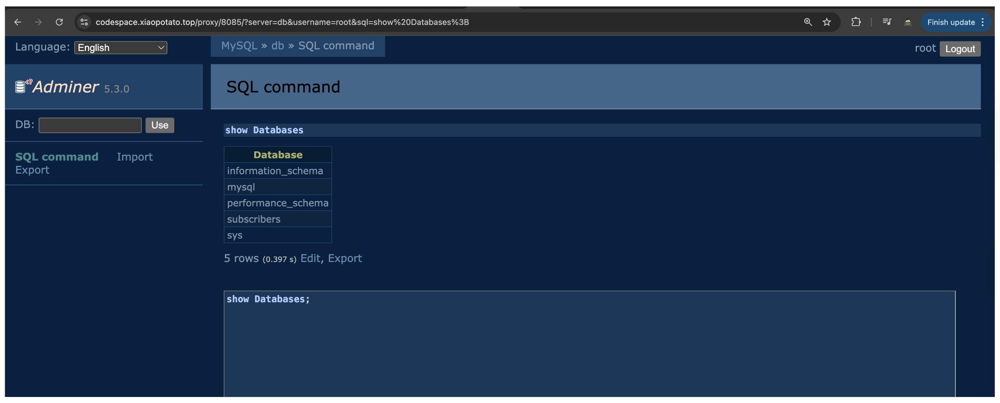

# Subscriber micro frontend

autonomous component to add names to a subscriber database

Url: https://s8r.xiaopotato.top/




To set up the environment

```bash
ansible-playbook up.yml
```

To use mysql:

```bash
mysql -u root -h 127.0.0.1 -p
```

To run github action with flyway migration (notice that the environment variables default for the local case):

```yaml
steps:
  - name: Checkout code
    uses: actions/checkout@v2

  - name: Install MySQL client
    run: sudo apt-get update && sudo apt-get install -y mysql-client

  - name: Deploy to Database
    env:
      DB_HOST: ${{ secrets.DB_HOST || '127.0.0.1' }}
      DB_USER: ${{ secrets.DB_ADMIN_USER || 'root' }}
      DB_PASSWORD: ${{ secrets.DB_PASSWORD  || 'Secret5555'}}
      DB_NAME: ${{ secrets.DB_NAME || 'mysql' }}
    run: mysql -h $DB_HOST -u $DB_USER -p$DB_PASSWORD $DB_NAME < schema_changes.sql
```

locally:

to run act in a container

```bash
bin/act
```

to run act in the host address space to conserve resource

```bash
bin/act -P ubuntu-latest=-self-hosted
```

to run in the codespace.

To shut down:

```bash
ansible-playbook down.yml
```

There is also a flyway migration here. To run the migration:

```bash
docker run --rm -v "/workspaces/<repo name>/migrations:/flyway/sql" redgate/flyway -user=root -password=Secret5555 -url=jdbc:mysql://172.17.0.1:3306/flyway_test migrate
```

This is a reproducible mysql setup, with a flyway migration. It is also the start of an example of using flyway and github actions together. Flyway (jdbc) needs the database to exist. The github action creates it if it doesn't exist and flyway takes over from there.

There is also a micro frontend ui. For development it is run in 2 terminal windows.

1. To compile the javascript:

```bash
npm run watch
```

2. To run the fastapi server code:

```bash
python app.py
```

There is an index.html that includes the microfrontend for testing.
